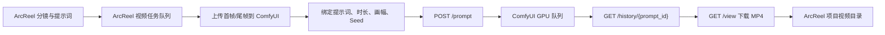

# ArcReel × 本地 ComfyUI 视频流水线

本功能把 ComfyUI 的一个成功视频工作流导入为 ArcReel 的“自定义视频模型”。之后 ArcReel
原有的分镜批量队列可以直接调用该工作流：上传分镜图、写入提示词和参数、排队生成、轮询任务，
最后把 MP4 下载回 ArcReel 项目目录。ArcReel 部署到云服务器后，也可以通过私有网络继续调用
家中或办公室电脑上的 ComfyUI。

## 数据流



ArcReel 会在提交成功后保存 ComfyUI 的 `prompt_id`。ArcReel Worker 重启后会先查询历史和
队列并继续轮询，不会直接重复提交同一个生成任务。

## 1. 准备 ComfyUI 工作流

先在 ComfyUI 中完整成功运行一次目标视频工作流。当前自动导入要求：

- 有可识别的提示词输入：`prompt`、`text` 或 `positive_prompt`；
- 有首帧输入；ArcReel 当前视频流水线是图生视频路径；
- 使用 `SaveVideo` 节点，并带 `filename_prefix` 输入；
- 输出格式是 MP4、WebM、MOV、MKV 或 AVI；
- 可选识别尾帧、`seed`、`duration`、`aspect_ratio`。

导入时会清除历史任务里的旧提示词、图片路径、Seed 和输出前缀，保存为可复用模板。工作流里的
模型、采样器、LoRA、节点参数等其他设置会保留。因此不同参数的成功工作流可能会导入为不同配置。

## 2. 云端 ArcReel 连接本地 ComfyUI

推荐让云服务器和本地 Windows 电脑加入同一个 Tailscale tailnet，不要把 ComfyUI 端口直接暴露
到公网。Tailscale Serve 可以把只监听 `127.0.0.1:8188` 的 ComfyUI 通过 tailnet 内的 HTTPS 地址
提供给云服务器：

```powershell
tailscale serve --bg localhost:8188
tailscale serve status
```

命令会显示类似 `https://your-pc.your-tailnet.ts.net` 的私有地址。将这个地址填入 ArcReel 的
Base URL。在云服务器上先验证：

```bash
curl https://your-pc.your-tailnet.ts.net/system_stats
```

官方参考：[Tailscale Serve](https://tailscale.com/docs/features/tailscale-serve) 和
[Serve 命令](https://tailscale.com/docs/reference/tailscale-cli/serve)。

如果不用 Tailscale Serve，也可以让 ComfyUI 监听本机 Tailscale IP，再通过 tailnet IP 访问；
此时务必用防火墙把 8188 端口限制在 Tailscale 网卡。不要使用 Tailscale Funnel，Funnel 会把
服务暴露到公网。

## 3. 升级数据库

拉取本分支后，在 ArcReel 目录执行：

```powershell
uv run alembic upgrade head
```

迁移会给自定义供应商模型增加 `endpoint_config` 字段，用于保存经过清理的 ComfyUI 工作流模板。

## 4. 在 ArcReel 设置中导入

进入“设置 → 供应商 → 添加自定义供应商”：

1. 模型发现协议选择“ComfyUI 工作流”；
2. Base URL 填 Tailscale Serve 地址或局域网地址；
3. API Key 通常留空；只有额外反向代理使用 Bearer Token 时才填写；
4. 点击“测试连接”；
5. 点击“导入近期成功工作流”；
6. 检查导入的工作流、支持时长和尾帧能力；
7. 视频并发建议保持 `1`，然后保存；
8. 在“模型选择”中把导入项设为默认视频模型或图生视频模型。

导入会检查最近 30 个历史任务，忽略失败任务、非视频任务和无法识别首帧的工作流。相同模板会
去重；同名但参数不同的模板会在名称后显示短 ID，便于区分。

## 5. 批量生产行为

无需新增一套批处理入口。ArcReel 现有的视频生成与智能体批量生成会继续写入统一任务队列：

- 每个分镜形成一个独立任务；
- ArcReel 上传该分镜的首帧和可选尾帧；
- 生成提示词、时长、画幅和 Seed 被写入工作流副本；
- ComfyUI 自己的队列负责 GPU 顺序执行；
- 成功后 MP4 通过 `/view` 流式下载到临时 `.part` 文件，再原子替换目标文件；
- 云端只保存下载后的项目文件，不把仅 tailnet 可访问的 ComfyUI URL暴露给浏览器。

## 运维注意事项

- 本地电脑、ComfyUI 和 Tailscale 必须保持在线；电脑休眠时云端无法继续生成。
- 12GB 显存建议 ArcReel 视频并发为 1；ComfyUI 内部仍可继续排队。
- 云端 ArcReel 不需要安装 ComfyUI 模型或自定义节点；这些只需安装在实际运行 GPU 的本地电脑。
- 如果工作流节点或输入字段发生变化，先在 ComfyUI 成功运行新版，再回 ArcReel 重新导入并保存。
- ComfyUI 清理历史后，已提交但尚未完成的旧任务可能无法接续；ArcReel 会标记为恢复已过期，
  不会盲目重复提交。
- 工作流模板会存入 ArcReel 数据库。虽然导入过程会清理常见的运行时路径和内容，仍应只导入
  自己信任的工作流。
